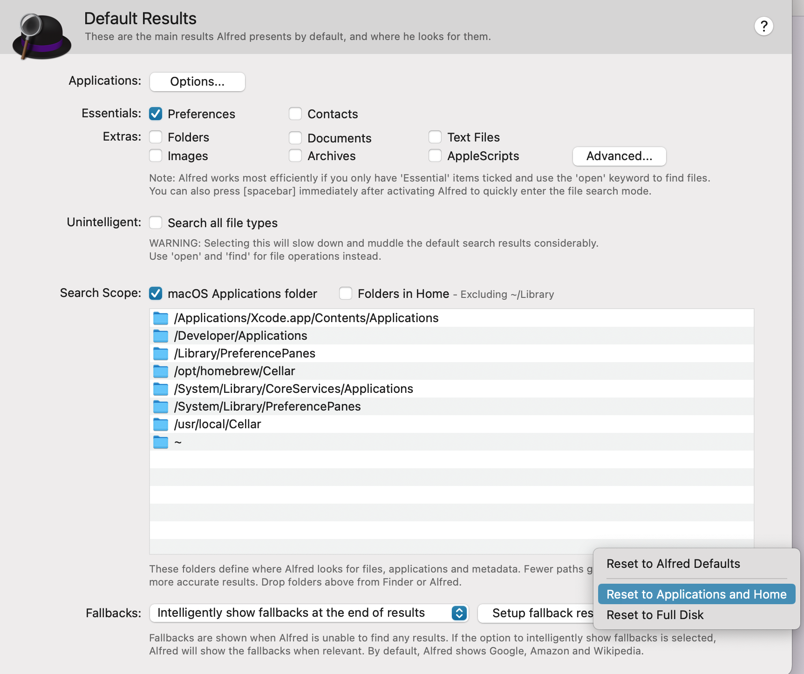

# What

Dropbox beta 版本（V162.3.5408）的文件夹移动到 `/Users/user/Library/CloudStorage/Dropbox` 后，Alfred 无法搜索 Dropbox 中的文件。

图 问题

# How to

通过 [File search issues with beta for Mac - Dropbox Community](https://www.dropboxforum.com/t5/Delete-edit-and-organize/File-search-issues-with-beta-for-Mac/td-p/621963) 找到链接 [Alfred cannot find files after installing Dropbox Beta for CloudStorage (Intel)](https://www.alfredforum.com/topic/18184-alfred-cannot-find-files-after-installing-dropbox-beta-for-cloudstorage-intel/#comment-100100)，按 Vero 的方法解决问题。

图 设置 (Find Reset button and press it)

图 搜索结果

